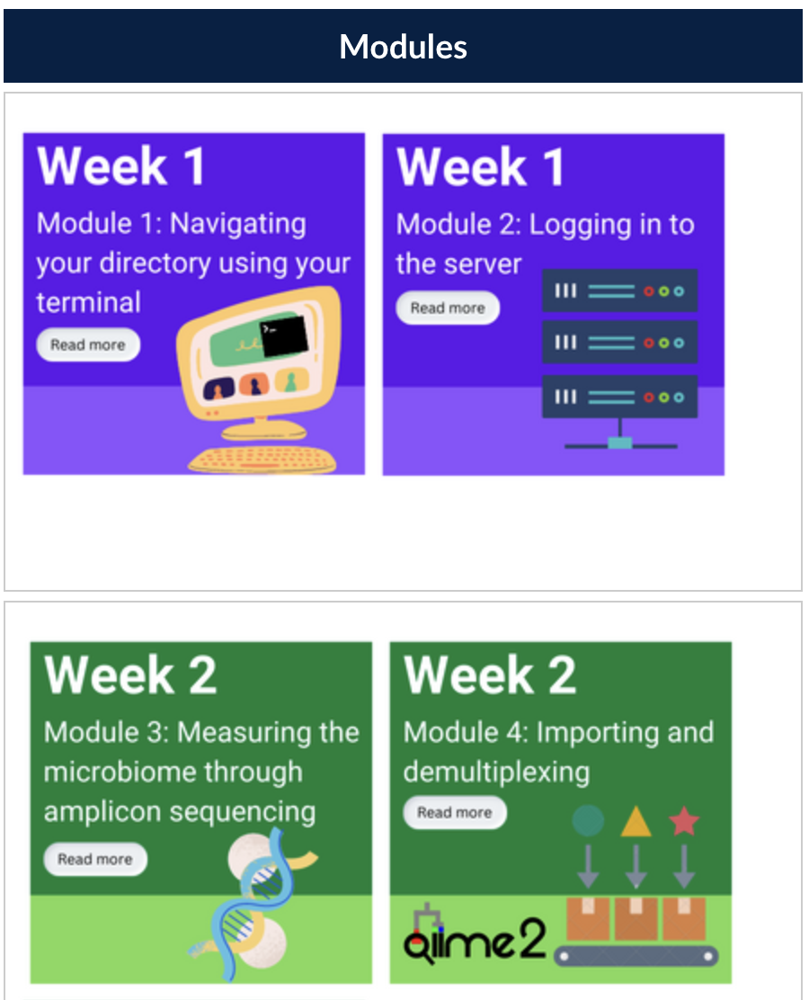
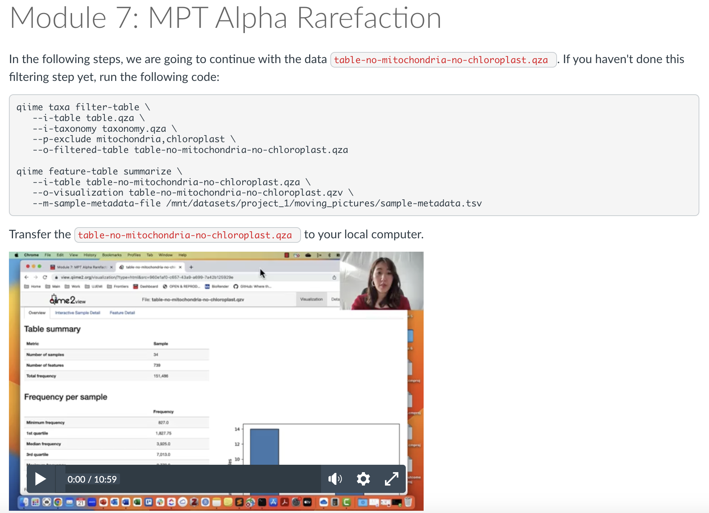

# MICB 475: Data Science Research in Microbiology
This repository stores all the online module components of UBC's MICB 475: Data science research in microbiology course

## Summary
MICB 475 is a data science course-based undergraduate research experience (CURE) developed at the University of British Columbia's Department of Microbiology and Immunology. The courses focuses on amplicon sequencing data as a gateway into data science research. The course consists of 4 phases: scaffolding, planning, experimentation, and dissemination. This repository focuses on the hybrid scaffolding phase of the course where students learn command line and QIIME2 (Modules 1-8) and R/RStudion (Modules 9-18) using the Moving Pictures Tutorial dataset (https://docs.qiime2.org/2022.2/tutorials/moving-pictures/).

