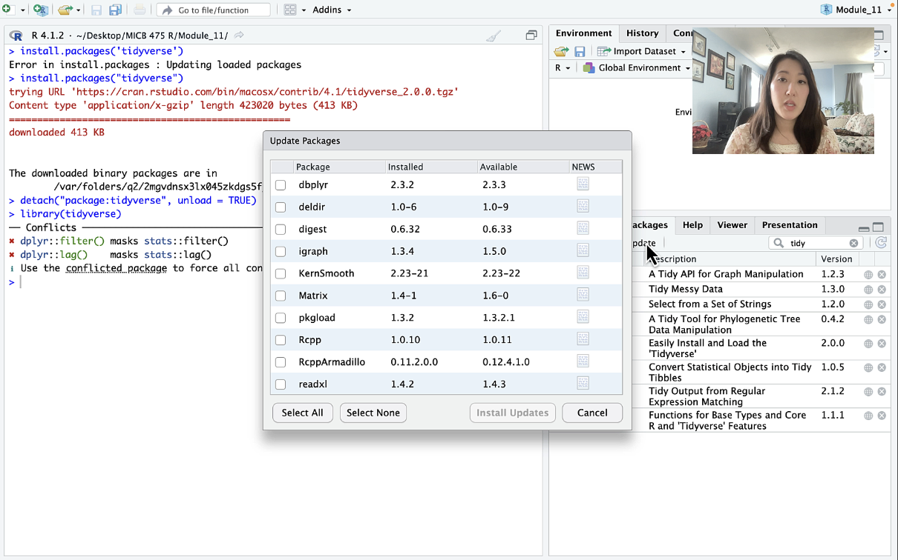

# MICB 475: Data Science Research in Microbiology
This repository stores all the online module components of UBC's MICB 475: Data science research in microbiology course

## Summary
MICB 475 is a data science course-based undergraduate research experience (CURE) developed at the University of British Columbia's Department of Microbiology and Immunology. The courses focuses on amplicon sequencing data as a gateway into data science research. The course consists of 4 phases: scaffolding, planning, experimentation, and dissemination. This repository focuses on the hybrid scaffolding phase of the course where students learn command line and QIIME2 (Modules 1-8) and R/RStudio (Modules 9-18) using the Moving Pictures Tutorial dataset (https://docs.qiime2.org/2022.2/tutorials/moving-pictures/).

Modules are comprised of video tutorials, markdown scripts, and coding exercises. 

## Rationale for hybrid model
The benefits of this delivery mode for a data science course of this nature includes:
  * it serves a wider range of prior expertise in a more optimal manner than the course when it was completely online or completely in person
  * it is modelled after how other units like computer science teach some of their data science courses or programs
  * this model complements a mix of hands-on practice and theory in a less constrained manner compared to synchronous modes of delivery

[Feedback collected from students](#feedback) during the first iteration of this course speak to its effectiveness in teaching beginners data science but still challenging students who enter the course with a stronger data science background. 

## Table of Contents
   * [Module 1: Navigating your directory using your terminal](#module-1)
   * [Module 2: Logging in to the server](#module-2)
   * [Module 3: Measuring the microbiome through amplicon sequencing](#module-3)
   * [Module 4: Importing and demultiplexing](#module-4)
   * [Module 5: Determining your amplicon sequencing variants (ASVs)](#module-5)
   * [Module 6: Taxonomic analysis and data filtering](#module-6)
   * [Module 7: Diversity metrics](#module-7)
   * [Module 8: Getting started with Project 2](#module-8)
   * [Module 9: Exporting files from QIIME2](#module-9)
   * [Module 10: Introduction to R](#module-10)
   * [Module 11: Loading packages and using tidyverse](#module-11)
   * [Module 12: Visualizing using ggplot2](#module-12)
   * [Module 13: Phyloseq and microbial dataset analysis](#module-13)
   * [Module 14: Statistics with one independent and dependent variable](#module-14)
   * [Module 15: Statistics with multiple variables](#module-15)
   * [Module 16: Identifying interesting ASVs](#module-16)
   * [Additional modules](#additional-modules)
   * [Course Feedback](#feedback)

## Module 1
### Navigating your directory using your terminal
By the end of this module, if all practice activities and tutorials are completed, a student will be able to:
1. Differentiate between the shell and kernel of your computing system
2. Open up your computer's terminal (ie. command line interface) 
3. Use basic bash commands to navigate your local environment

**Example exercise**:

You start in the directory experiment and execute the following commands:
<pre>
mkdir raw_data
mkdir processed_data
cd raw_data
mkdir sequences
cd sequences
touch bacteria_1.txt
cd ..
touch sequences/bacteria_2.txt
cd ..
mkdir raw_data/metadata
touch raw_data/metadata/metadata.txt
cp raw_data/sequences/bacteria_1.txt processed_data/bacteria_1_analysed.txt
cd processed_data
cp ../raw_data/sequences/bacteria_2.txt bacteria_2_analysed.txt
rm bacteria_1_analysed.txt
</pre>
Without executing the commands, predict the file structure including all directories and files in the directory experiment?

## Module 2
### Logging in to the server
By the end of this module, if all practice activities and tutorials are completed, a student will be able to:
1. Access our remote server
2. Navigate the server using the commands learned in Module 1
3. Transfer files to and from the server
4. Run background jobs

Weekly assignment: draw out the file path for the <code>/mnt</code> (mount) folder in the server

## Module 3
### Measuring the microbiome through amplicon sequencing
By the end of this module, if all practice activities and tutorials are completed, a student will be able to:
1. Define what the microbiome is and why it is important
2. Describes the steps involved in Amplicon Sequencing
3. Explain what are the possible outputs (ie. files and data) from amplicon sequencing

## Module 4
### Importing and demultiplexing
By the end of this module, if all practice activities and tutorials are completed, a student will be able to:
1. Import different types of sequencing files into QIIME2 with or without a manifest file
2. Demultiplex using QIIME2

## Module 5
### Determining your amplicon sequence variants (ASVs)
By the end of this module, if all practice activities and tutorials are completed, a student will be able to:
1. Denoise your data by trimming your reads and removing low quality reads using DADA2 or Deblur
2. Cluster unique reads in your data called Amplicon Sequence Variants (ASVs)
3. Distinguish between ASVs and OTUs

## Module 6
### Taxonomic analysis and data filtering
By the end of this module, if all practice activities and tutorials are completed, a student will be able to:
1. Train a classifier to do taxonomic analysis
2. Generate and interpret a taxa bar graph
3. Filter your ASV table based on taxonomy, frequency, or metadata

## Module 7
### Diversity Metrics
By the end of this module, if all practice activities and tutorials are completed, a student will be able to:
1. Define “microbial diversity” based on 3 key parameters
2. Rarefy your data before running your diversity metrics analysis
3. Interpret box plots and principle component analyses (PCA)

## Module 8
### Getting started with project 2
The synchronous components of the course begin during this week where student teams of 3-4 meet weekly with the teaching team to start to develop their research proposals and ultimately carry out their capstone research projects for the remainder of the course. Students will present their findings at the end of the term as an oral presentation and written manuscript to be published in the [Undergradute Journal of Experimental Microbilogy and Immonology](https://jemi.microbiology.ubc.ca/).

## Module 9
### Exporting files from QIIME2
By the end of this module, if all practice activities and tutorials are completed, a student will be able to:
1. Export QIIME2 files (.qza) into human-readable formats (eg. .txt, .tsv, .csv)
2. Use bash to view text files
3. Download R and RStudio

Students continue to use the moving pictures tutorial dataset in the R modules (module 10 - 16)

## Module 10
### Introduction to R
By the end of this module, if all practice activities and tutorials are completed, a student will be able to:
1. Identify the different components of RStudio
2. Perform basic operations using variables and objects
3. Understand differences between variable/object types and data structures in R
4. Use functions in R
5. Load data in R and inspect that it is loaded properly

Starting in this module as students learn R, they are provided with R markdown scripts to follow along. Markdown scripts can be found in the repective folders within this repository. Modules 10-12 cover basic R theory before starting microbiome analyses using phyloseq in Module 13. 

## Module 11
### Loading packages and using tidyverse
By the end of this module, if all practice activities and tutorials are completed, a student will be able to:
1. Identify the different components of RStudio
2. Perform basic operations using variables and objects
3. Understand differences between variable/object types and data structures in R
4. Use functions in R
5. Load data in R and inspect that it is loaded properly

Starting in this module as students learn R, they are provided with R markdown scripts to follow along. Markdown scripts can be found in the repective folders within this repository.

## Module 12
### Visualizing with ggplot2
By the end of this module, if all practice activities and tutorials are completed, a student will be able to:
1. Understand the basic theory behind the grammar of visualization used by ggplot (plot, aesthetics, geometric objects)
2. Use basic ggplot geometric objects (point, line, boxplot, histogram, smooth)
3. Adjust aesthetic attributes of geometric objects in ggplot (color, shape, line type) and create multi-panel figures with ‘facet’

## Module 13
### Phyloseq and microbial dataset analysis
By the end of this module, if all practice activities and tutorials are completed, a student will be able to:
1. Create phyloseq objects
2. Filter taxa and samples from phyloseq objects
3. Rarefy ASV tables in a phyloseq object
4. Re-create taxa summary plots, alpha diversity boxplots, and beta diversity PCoA plots with phyloseq

## Module 14
### Statistics with one independent and dependent variable
By the end of this module, if all practice activities and tutorials are completed, a student will be able to:
1. Define key terms in statistics that will help you differentiate between certain statistical test
2. Differentiate between a parametric and non-parametric test, and identify the situation in which you would use one or the other
3. Use a t-test and Wilcoxon rank sum test to compare two means
4. Use ANOVA and Kruskall-wallis tests to compare multiple means
5. Use Pearson correlation and Kendall correlation tests to correlate two continuous variables

Module 14-15 will cover basic statistical analysis including single variable comparisons (Module 14) and multiple variable comparisons (Module 15). This includes both parametric and non-parametric tests. 

## Module 15
### Statistics with multiple variables
By the end of this module, if all practice activities and tutorials are completed, a student will be able to:
1. Use two-way ANOVAs and linear models to test for effects across multiple predictors
2. Use a MANOVA or PERMANOVA in R to test for effects in multiple response variables
3. Interpret model outputs and explain what single and interaction effects mean in two-way models

Module 14-15 will cover basic statistical analysis including single variable comparisons (Module 14) and multiple variable comparisons (Module 15). This includes both parametric and non-parametric tests. 

## Module 16
### Identifying interesting ASVs
By the end of this module, if all practice activities and tutorials are completed, a student will be able to:
1. Differentiate between abundance and prevalence
2. Identify “core microbiome” members (by specifying and justifying abundance and prevalence thresholds)
   * Create Venn Diagrams to visualize member overlap
3. Explain the theory behind Indicator Species Analysis and conduct Indicator Species Analysis in R
4. Explain the theory behind DESeq and conduct DESeq analysis in R
   * Interpret Volcano plots and expression bar graphs

Below are some of the outputs that students generated using three different analyses demonstrated in this module:

## Additional Modules
### Module 17: Disseminating your research
This module covers how to prepare an effective oral presentation and written manuscript that follows industry standards and the course expectations. This is the last of the mandatory modules. Students usually go through this module closer to the end of the term when their final projects are due. 

### Module 18: Using Git and Github to document your work
This is an optional module that introduces students to the following:
1. How do we use Github
2. How to format your readme file
3. Using git on command line
4. Git integrated to RStudio
5. Using GitHub desktop

## Feedback
MICB 475 was delivered for the first time in Jan 2023 as a hybrid course. This mid-term feedback survey was sent to MICB 475 students in Feb of 2023. 34 students out of 74 (46% response rate) participated in the survey. Website analytics were collected from Canvas as a means of measuring page access from all 74 students at the end of the term (April 2023). The feedback is summarized here.

Students were asked for their preference in course format for the scaffolding phase (left) and what prior experience they had with data science (right). Zero students reported having any experience with Unix alone. n=34.

Students were asked whether they agree or disagree that each of these course components were effective in promoting learning in the course:

Students were asked if an appropriate amount of time was spent going over each module. Modules are clustered based by week:

Summary of page views data collected from Canvas analytics that summarizes the average page views per module. Color coding shows the percentage of students in the course who accessed those pages:

As per the data, the majority of students coming in the course had R experience but not Unix. This reflects the higher amount of page views and access in the earlier modules (Modules 1-8) compared to the R component (Modules 9-16). Students also reported wanting to spend more time on the Unix modules compared to the R modules.

